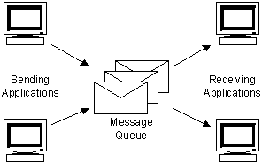

### Hi there 👋

* try to be an excellent software engineer !

**Languages and Tools:**  
<code></code>
<code></code>
<code></code>
<code></code>
<code></code>
---  

<code></code>
<code></code>
<code></code>
<code></code>
<code></code>
<code></code>
---  

<code></code>
<code></code>
<code></code>
<code></code>
---
